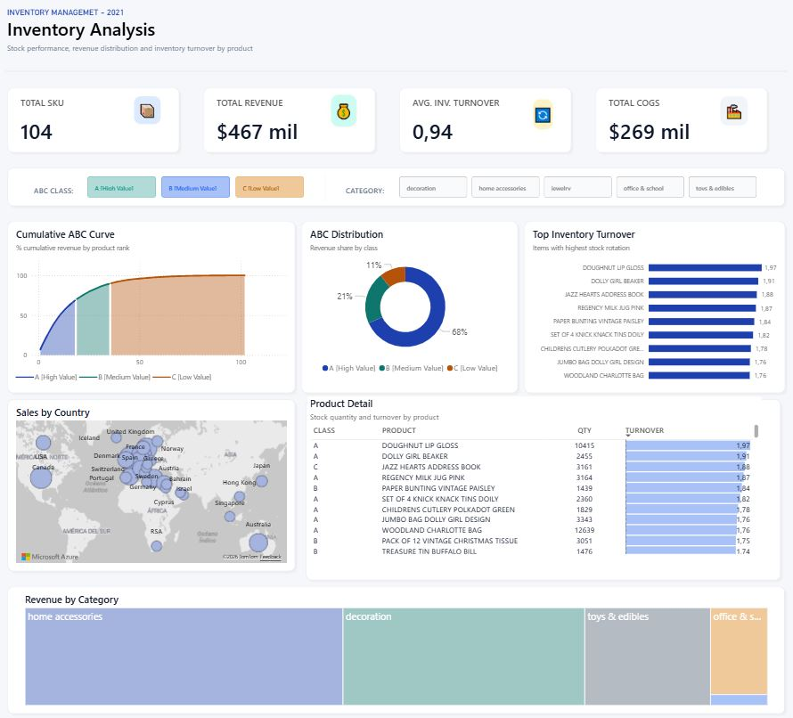
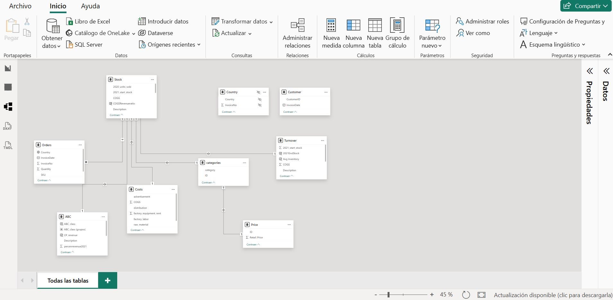

 # Inventory Analysis 


Interactive inventory analysis dashboard combining ABC classification, stock turnover, geographic sales distribution, and category performance. Built in Power BI with a custom relational data model.

---


## Dashboard Preview



---

## Objective

Design an inventory analysis system that allows operations and supply chain teams to identify which products generate the most value, monitor turnover by SKU, detect cost and stock optimization opportunities, and visualize the geographic distribution of sales.


---

## Data Model

The model follows a star schema architecture with `categories` as the central dimension table.



| Table | Key Fields | Role |
|---|---|---|
| Orders | Country, InvoiceDate, InvoiceNo, Quantity, SKU | Fact table — transactions |
| categories | category, ID | Central dimension |
| Stock | 2020 units sold, 2021 start stock, COGS, COGSRevenueratio, Description | Product-level inventory data |
| Costs | advertisement, COGS, distribution, factory_equipment_rent, factory_labor, raw_material | Cost structure breakdown |
| Price | ID, Retail Price | Retail price per product |
| Turnover | 2021 start stock, 2021EndStock, Avg Inventory, COGS, Description | Inventory turnover calculation |
| ABC | ABC class, ABC class (groups), CP revenue, Description, percentrevenue2021 | ABC classification and revenue share |
| Country | Country, InvoiceNo | Geographic dimension |
| Customer | CustomerID, InvoiceDate | Customer dimension |

---

## KPIs

| Metric | 2021 Value |
|---|---|
| Total SKUs | 104 |
| Total Revenue | $467 million |
| Avg. Inventory Turnover | 0.94 |
| Total COGS | $269 million |
| Estimated Gross Margin | ~42% ($198M) |

---

## Findings

**ABC Classification**

The revenue distribution confirms the Pareto principle: a minority of SKUs concentrates the majority of value. Class A accounts for 68% of total revenue, Class B for 21%, and Class C for the remaining 11%. This means high-value products are critical to the operation, while Class C generates a disproportionate operational burden relative to its contribution.

**Inventory Turnover**

The global average turnover of 0.94 indicates that inventory does not complete a full cycle within a year. However, there is a significant gap between top-performing products and the rest:

| Product | Turnover |
|---|---|
| Doughnut Lip Gloss | 1.97 |
| Dolly Girl Beaker | 1.91 |
| Jazz Hearts Address Book | 1.88 |
| Regency Milk Jug Pink | 1.87 |
| Paper Bunting Vintage Paisley | 1.84 |
| Set of 4 Knick Knack Tins Doily | 1.82 |
| Childrens Cutlery Polkadot Green | 1.78 |
| Jumbo Bag Dolly Girl Design | 1.76 |
| Woodland Charlotte Bag | 1.76 |

Top products nearly double the average benchmark, indicating sustained and predictable demand.

**Geographic Distribution**

The United Kingdom and Western Europe concentrate the largest share of sales volume. APAC (Japan, Singapore, Hong Kong, Australia) shows relevant presence. North America and Latin America have low participation, representing a clear expansion opportunity for a portfolio oriented toward home accessories and decoration.

**Revenue by Category**

Home Accessories leads in volume, followed by Decoration, Toys & Edibles, and Office & School. The business is clearly oriented toward lifestyle and home decor.

---

## Recommendations

**Optimize Class C**

Class C SKUs generate only 11% of revenue but require active warehouse management, reordering, and administration. The recommendation is to apply progressive liquidation for the lowest-turnover products, migrate to a make-to-order model where feasible, and evaluate discontinuation of SKUs with turnover below 0.5.

**Capitalize on high-turnover products**

Products like Doughnut Lip Gloss and Dolly Girl Beaker turn at twice the average rate. Increasing safety stock on these SKUs would prevent stockouts and lost sales. They can also be used as anchor products in campaigns and bundles to drive lower-performing categories.


**Improve global turnover**

A turnover of 0.94 can be improved by implementing demand forecasting based on historical data by SKU and region, reducing lead times with Class A suppliers, and reviewing reorder policies for Class B products showing upward trends.

---

## Technologies

| Tool | Usage |
|---|---|
| Power BI Desktop | Data model development and dashboard design |
| DAX | Calculated measures (Turnover, ABC Class, % Revenue, Avg Inventory) |
| Power Query | Data transformation and cleaning |


## Repository Structure

```
inventory_analysis/
├── InventoryAnalysis.pbix
├── Datasets/
│   ├── WarmeHands-data.xlsx
│   ├── categories.csv
│
├── assets/
│   ├── Inventory_Analysis.JPG
│   └── data_model.JPG
└── README.md
```

---
